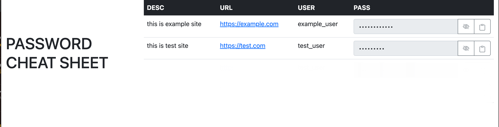

# PasswordCheatSheet

Welcome to your new gem! In this directory, you'll find the files you need to be able to package up your Ruby library into a gem. Put your Ruby code in the file `lib/password_pocket_book`. To experiment with that code, run `bin/console` for an interactive prompt.

TODO: Delete this and the text above, and describe your gem

## Installation

Add this line to your application's Gemfile:

```ruby
gem 'password_cheatsheet'
```

And then execute:

    $ bundle install

Or install it yourself as:

    $ gem install password_cheatsheet

## Usage

```ruby
    password_data = <<~EOS
      -
        url: https://example.com 
        user: example_user  
        pass: example_pass
        desc: this is example site
      -
        url: https://test.com
        user: test_user
        pass: test_pass
        desc: this is test site
    EOS

    yml = YAML.load(password_data) 
    html = PasswordCheatSheet::to_html(yml)
    File.write('out.html', html)
```

Output HTML


## License

The gem is available as open source under the terms of the [MIT License](https://opensource.org/licenses/MIT).